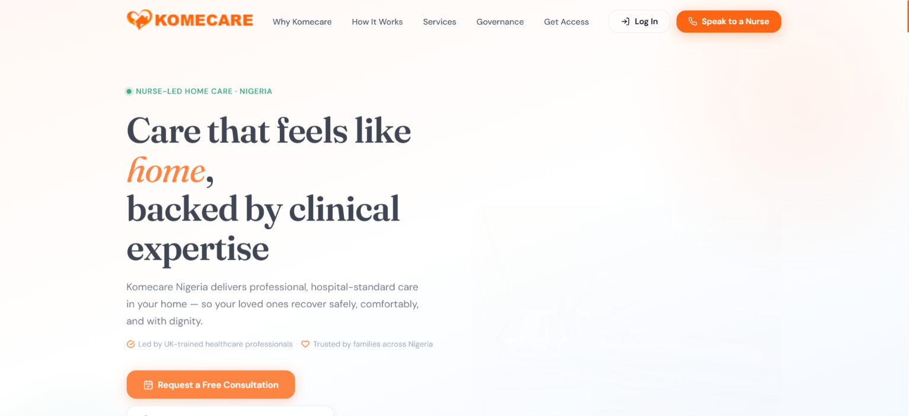
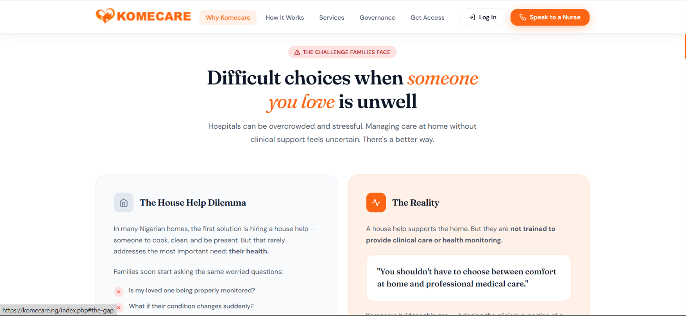
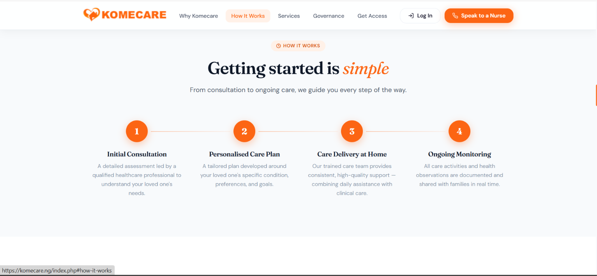
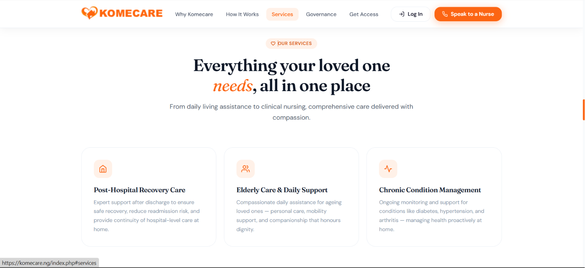
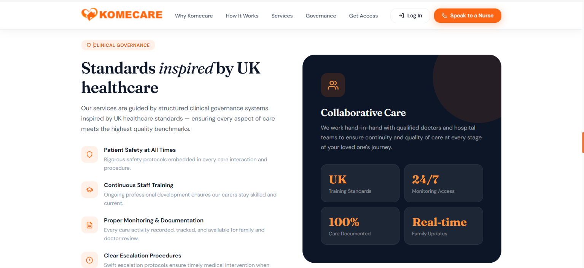
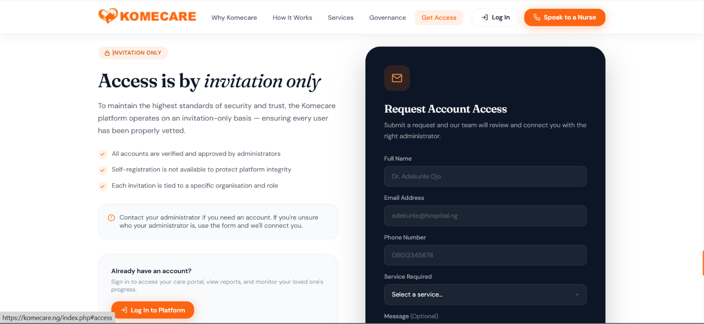
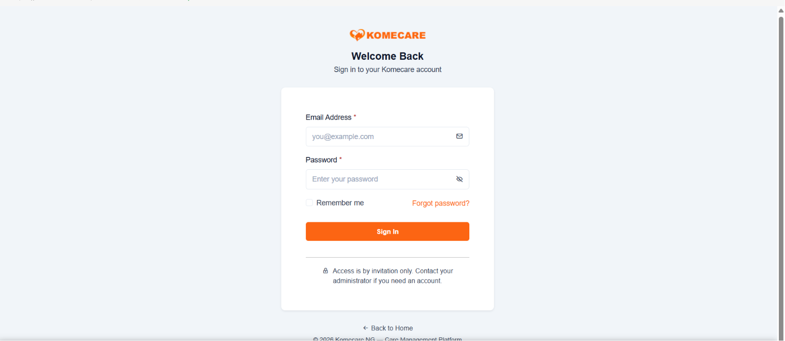
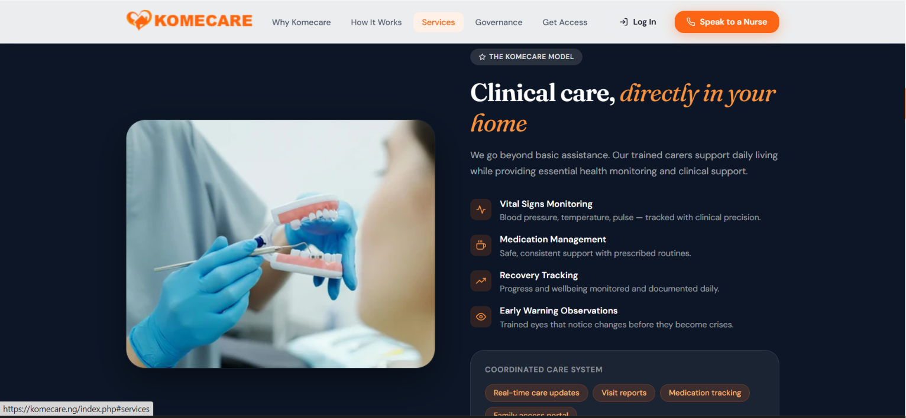

# Kome Care — Nurse-Led Home Care Management Platform

Kome Care is a full-stack care management platform built to digitalise and streamline 
the operations of a nurse led home care service in Nigeria. The system manages the full 
lifecycle of care delivery from staff onboarding and document verification, through 
shift scheduling and availability tracking, to real-time stakeholder reporting.

The platform was designed around a multi-role access model reflecting real clinical 
workflows: administrators manage operations, care staff manage their schedules and 
documents, and stakeholders (families/clients) monitor care progress — all from a 
single unified system.

Built entirely from scratch in vanilla PHP with a MySQL backend, the architecture 
prioritises security (role-based session management, soft deletes, prepared statements 
throughout) and operational reliability for a live production environment currently 
serving users across Nigeria.

## 🌍 Live Site
[https://komecare.ng](https://komecare.ng)

> Access is invitation-only. For a demo or credentials, reach out via GitHub or DM me directly.

## 📸 Screenshots

### Landing Page

### Why Komecare

### How It Works

### Services

### Clinical Governance

### Get Access

### Platform Login

### Clinical Care Model

## ⚙️ Core Features
- **Multi-role authentication** — Admin, Staff, Stakeholder, Onboardee with 
  session-based access control
- **Staff onboarding pipeline** — end-to-end document collection, verification 
  and approval workflow
- **Shift management** — creation, assignment, availability matching and 
  completion tracking
- **Document management** — upload, status tracking, expiry monitoring and 
  soft deletion
- **Stakeholder portal** — real-time visibility into care progress and staff assignments
- **Email notification system** — automated alerts for key workflow events
- **Audit trail** — soft deletes and status history across all core entities

## 🛠️ Tech Stack
| Layer | Technology |
|---|---|
| Backend | PHP (vanilla, OOP) |
| Database | MySQL via PDO |
| Frontend | Bootstrap, jQuery, HTML5 |
| Auth | PHP Sessions, password_hash |
| Email | PHPMailer + native mail() |
| Server | Apache (.htaccess routing) |

## 🔐 Security
- Prepared statements across all DB queries (no raw SQL)
- Role-based session guards on every endpoint
- Soft deletes to preserve data integrity
- Environment variables for all credentials (never hardcoded)
- Error display disabled in production

## 🚀 Local Setup
1. Clone the repository
2. Create a `.env` file — see `.env.example` for required variables
3. Import the database schema into MySQL
4. Point your local server (XAMPP/Apache) to the project root
5. Visit `http://localhost/komecare`

> Contact **info@komecare.ng** for environment credentials or a live demo

## 📄 License
Private — All rights reserved. Kome Care NG © 2026